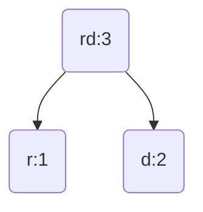
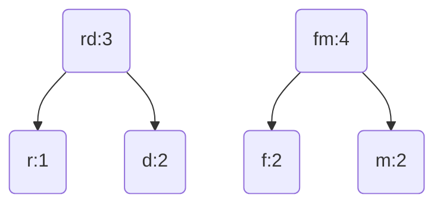
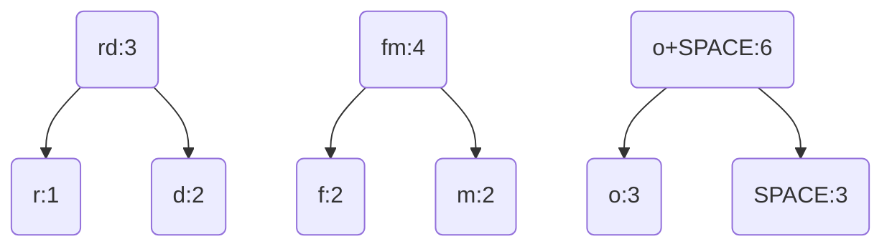
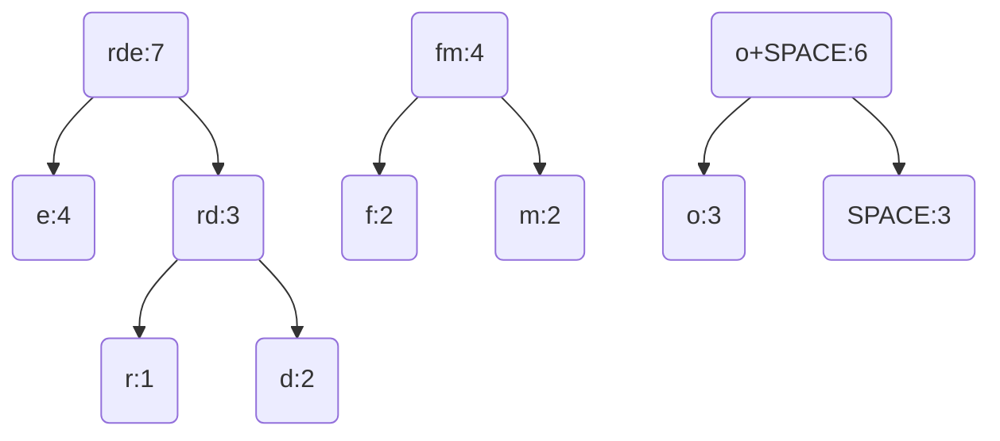
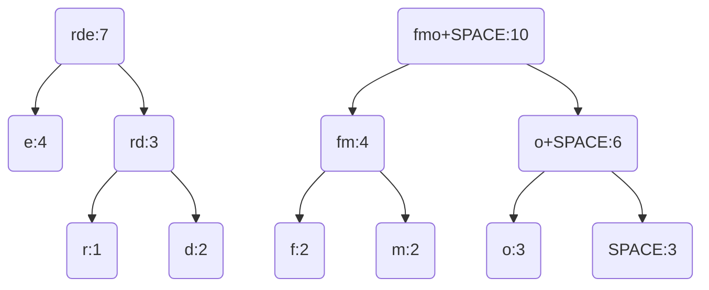
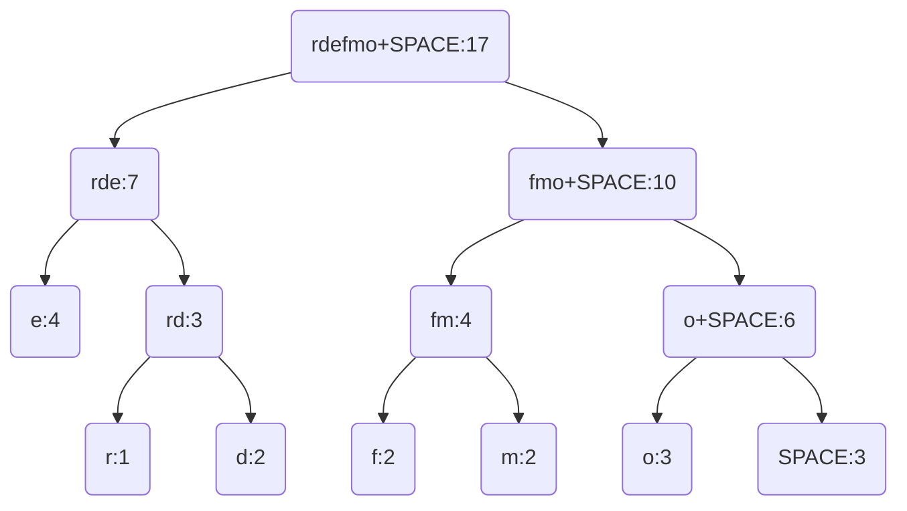

> Huffman coding is a **lossless** data compression algorithm. The idea is to assign variable-length codes to input characters, lengths of the assigned codes are based on the frequencies of corresponding characters.

<figure>
  
  <figurecaption>Figure 1. Huffman tree generated from the exact frequencies of the text "this is an example of a huffman tree". The frequencies and codes of each character are below. Encoding the sentence with this code requires 195 (or 147) bits, as opposed to 288 (or 180) bits if 36 characters of 8 (or 5) bits were used. (This assumes that the code tree structure is known to the decoder and thus does not need to be counted as part of the transmitted information.)</figurecaption>
</figure>


# The Huffman Encoding

The process of finding and/or using such a code proceeds by means of Huffman coding, an algorithm developed by [David A. Huffman](https://en.wikipedia.org/wiki/David_A._Huffman) while he was a Sc.D. student at MIT, and published in the 1952 paper ["A Method for the Construction of Minimum-Redundancy Codes"](https://en.wikipedia.org/wiki/Huffman_coding#cite_note-1).

## Overview

The video below is Huffman Encoding section of CS225 Online Series taught by Chase Geige. It is strongly recommended that you watch the video to understand the motivation for why we're talking about Huffman Encoding as well as how the algorithm works. If you are interested in seeing a step-by-step execution of the Huffman Tree algorithms, please watch it:


<!--<iframe width="652" height="451" src="https://www.youtube.com/embed/fWk6Y8Rd6bs" frameborder="0" allow="accelerometer; autoplay; encrypted-media; gyroscope; picture-in-picture" allowfullscreen></iframe>-->


In a nutshell, Huffman encoding takes in a text input and generates a binary code (a string of 0's and 1's) that represents that text.
{:.info}

## Building the Huffman tree

Input is array of unique characters along with their frequency of occurrences and output is Huffman Tree.

1. Create a leaf node for each unique character and build a min heap of all leaf nodes (Min Heap is used as a priority queue. The value of frequency field is used to compare two nodes in min heap. Initially, the least frequent character is at root)
2. Extract two nodes with the minimum frequency from the min heap.
3. Create a new internal node with frequency equal to the sum of the two nodes frequencies. Make the first extracted node as its left child and the other extracted node as its right child. Add this node to the min heap.
4. Repeat steps #2 and #3 until the heap contains only one node. The remaining node is the root node and the tree is complete.


> Let's understand the algorithm with this example: "feed me more food"


**Step 1**: Calculate frequency of every character in the text, and order by increasing frequency. Store in a queue.


```
r : 1 | d : 2 | f : 2 | m : 2 | o : 3 | 'SPACE' : 3 | e :
```


**Step 2**: Build the tree from the bottom up. Start by taking the two least frequent characters and merging them (create a parent node for them). Store the merged characters in a new queue:




```
SINGLE: f : 2 | m : 2 | o : 3 | 'SPACE' : 3 | e : 4

MERGED: rd : 3
```


**Step 3**: Repeat Step 2 this time also considering the elements in the new queue. 'f' and 'm' this time are the two elements with the least frequency, so we merge them:




```
SINGLE: o : 3 | 'SPACE' : 3 | e : 4

MERGED: rd : 3 | fm : 4
```


**Step 4**: Repeat Step 3 until there are no more elements in the SINGLE queue, and only one element in the MERGED queue:



```
SINGLE: e : 4

MERGED: rd : 3 | fm : 4 | o+SPACE : 6
```




```
SINGLE:

MERGED: fm : 4 | o+SPACE : 6 | rde: 7
```




```
SINGLE:

MERGED: rde: 7 | fmo+SPACE: 10
```





```
SINGLE:

MERGED: rdefmo+SPACE: 17
```


## From Text to Binary


Now that we built our Huffman tree, its time to see how to encode our original message "feed me more food" into binary code.

**Step 1**: Label the branches of the Huffman tree with a '0' or '1'. BE CONSISTENT: in this example we chose to label all left branches with '0' and all right branches with '1'.

**Step 2**: Taking one character at a time from our message, traverse the Huffman tree to find the leaf node for that character. The binary code for the character is the string of 0's and 1's in the path from the root to the leaf node for that character. For example: 'f' has the binary code: `100`

So our message "feed me more food" becomes `10000000111111010011110111001000111100110110011`


**Efficiency of Huffman Encoding**  
Notice that in our Huffman tree, the more frequent a character is, the closer it is to the root, and as a result the shorter its binary code is. Can you see how this will result in compressing the encoded text?
{:.success}


## Implementation of Huffman Encoding

This snippet of codes is grabbed from [Huffman Coding | Greedy Algo-3](https://www.geeksforgeeks.org/huffman-coding-greedy-algo-3/) by [Aashish Barnwal](https://www.facebook.com/barnwal.aashish).


```cpp
// C++ program for Huffman Coding 
#include <bits/stdc++.h> 
using namespace std; 

// A Huffman tree node 
struct MinHeapNode { 

	// One of the input characters 
	char data; 

	// Frequency of the character 
	unsigned freq; 

	// Left and right child 
	MinHeapNode *left, *right; 

	MinHeapNode(char data, unsigned freq) 

	{ 

		left = right = NULL; 
		this->data = data; 
		this->freq = freq; 
	} 
}; 

// For comparison of 
// two heap nodes (needed in min heap) 
struct compare { 

	bool operator()(MinHeapNode* l, MinHeapNode* r) 

	{ 
		return (l->freq > r->freq); 
	} 
}; 

// Prints huffman codes from 
// the root of Huffman Tree. 
void printCodes(struct MinHeapNode* root, string str) 
{ 

	if (!root) 
		return; 

	if (root->data != '$') 
		cout << root->data << ": " << str << "\n"; 

	printCodes(root->left, str + "0"); 
	printCodes(root->right, str + "1"); 
} 

// The main function that builds a Huffman Tree and 
// print codes by traversing the built Huffman Tree 
void HuffmanCodes(char data[], int freq[], int size) 
{ 
	struct MinHeapNode *left, *right, *top; 

	// Create a min heap & inserts all characters of data[] 
	priority_queue<MinHeapNode*, vector<MinHeapNode*>, compare> minHeap; 

	for (int i = 0; i < size; ++i) 
		minHeap.push(new MinHeapNode(data[i], freq[i])); 

	// Iterate while size of heap doesn't become 1 
	while (minHeap.size() != 1) { 

		// Extract the two minimum 
		// freq items from min heap 
		left = minHeap.top(); 
		minHeap.pop(); 

		right = minHeap.top(); 
		minHeap.pop(); 

		// Create a new internal node with 
		// frequency equal to the sum of the 
		// two nodes frequencies. Make the 
		// two extracted node as left and right children 
		// of this new node. Add this node 
		// to the min heap '$' is a special value 
		// for internal nodes, not used 
		top = new MinHeapNode('$', left->freq + right->freq); 

		top->left = left; 
		top->right = right; 

		minHeap.push(top); 
	} 

	// Print Huffman codes using 
	// the Huffman tree built above 
	printCodes(minHeap.top(), ""); 
} 

// Driver program to test above functions 
int main() 
{ 

	char arr[] = { 'a', 'b', 'c', 'd', 'e', 'f' }; 
	int freq[] = { 5, 9, 12, 13, 16, 45 }; 

	int size = sizeof(arr) / sizeof(arr[0]); 

	HuffmanCodes(arr, freq, size); 

	return 0; 
} 

// This code is contributed by Aditya Goel 
```


## References

[1] Lab assignment of CS225: Data Structures in UIUC. [Hazardous Huffman Codes](https://courses.engr.illinois.edu/cs225/sp2018/labs/huffman/)  
[2] Video intro to huffman encoding by Chase Geige. [CS225 Online Series: Huffman Encodings](https://www.youtube.com/watch?time_continue=3&v=fWk6Y8Rd6bs)  
[3] GeeksforGeeks. [Huffman Coding | Greedy Algo-3](https://www.geeksforgeeks.org/huffman-coding-greedy-algo-3/)


<style>
.center {
    display: block;
    margin-left: auto;
    margin-right: auto;
}
</style>
