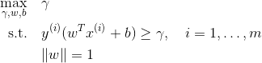
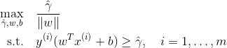
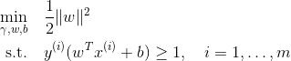
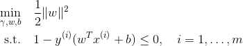
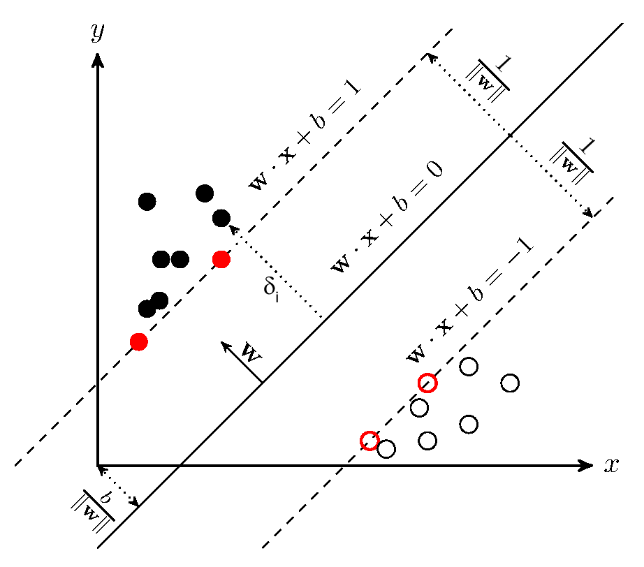

> *A Support Vector Machine (SVM) is a very powerful and versatile Machine Learning model, capable of performing linear or nonlinear classification, regression, and even outlier detection. It is one of the most popular models in Machine Learning, and anyone interested in Machine Learning should have it in their toolbox. SVMs are particularly well suited for classification of complex but small- or medium-sized datasets. In this tutorial, I will explain the core concepts of SVMs, how to use them, and how they work.*

# Support Vector Machines Explained

## Functional and geometric margins

### Functional margin

consider training example $(x^{(i)}, y^{(i)})$, the functional margin of $(w, b)$ w.r.t. the training example

a large functional margin represents a confident and a correct prediction.

$$
\hat{\gamma}^{(i)} = y^{(i)} (w^T x + b).
$$

Given training set $S = \{ (x^{(i)}, y^{(i)}); i = 1,\dots, m \}$, we also define the functional margin of $(w, b)$ w.r.t. $S$ to be smallest of the functional margins $\hat{\gamma}$ of the individual training examples.

$$
\hat{\gamma} = \min \limits_{i=1, \dots, m} \hat{\gamma}^{(i)}.
$$

### Geometric margin

$$
\gamma^{(i)} = y^{(i)} \Large( \large( \frac{w}{\|w\|} \large)^T x^{(i)} + \frac{b}{\|w\|} \Large).
$$

Given training set $S = \{ (x^{(i)}, y^{(i)}); i = 1,\dots, m \}$, we also define the geometric margin of $(w, b)$ w.r.t. $S$ to be smallest of the geometric margins $\gamma$ of the individual training examples.

$$
\gamma = \min \limits_{i=1, \dots, m} \gamma^{(i)}.
$$

## The optimal margin classifier

We assume the training set is linearly separable and we would like to find the maximum margin classifier. We pose the following optimization problem:

  

 

$\| w \| = 1$ ensures that the functional margin equals to geometric margin, but this constraint is "non-convex". The problem is transformed to be as follows:

  

 

Then we scale the factor of $w$ and $b$ to make $\hat{\gamma} = 1$. Note that maximize $\hat{\gamma} / \|w\| = 1/\|w\|$ is the same thing as minimize the $\|w\|^2$. We have the following optimization problem:

  

 

Its solution gives us **optimal margin classifier** and it is a quadratic programming (QP) problem which can be solved using and QP solver.

## Optimal margin classifiers

According to Largrange duality we re-write the constaints as

  

 

where

$$
g_i(w) = 1 - y^{(i)} (w^T x^{(i)} + b) \leq 0
$$

From KKT dual complementarily condition, we have $\alpha_i > 0$ only for the training examples with contraints $g_i(w) = 0$, where functional margin equals to $1$.

  
  
Support Vectors. Image source <a href="http://svm.michalhaltuf.cz/support-vector-machines/">Michal's blog of "Support vector machines"</a>

 

Something to remember concerning support vectors:

1. functional margin $\hat{\gamma} = 1$
2. $\alpha \neq 0$
3. $g_i(w) = 0$

### largrangian of optimization problem

derive dual problem of the primal problem here

## 4 Kernels

### Mercer Theorem

## Regularization and non-linear separable case

In order to make SVM work for **non-linearly separable datasets** as well as **less sensitive to outliers**. We introduce the $\ell_1$ regularization term, also people call this *softmargin SVM*

$$
\begin{align*}
\min_{r,w,b} \quad & \frac{1}{2}\|w\|^2 + C \sum_{i=1}^{m}{\xi_{i}}\\
\textrm{s.t.} \quad & y^{(i)}(w^T(x^{(i)}+b)) \geq 1 - \xi_{i} \quad i = 1, \dots, m\\
  & \xi_i \geq 0  \quad i = 1, \dots, m \\
\end{align*}
$$

## 6 Maximum margin solution in non-linearly separable case

### 6.1 Original form

### 6.2 Regularized form

### 6.3 Unconstrained form

## 7 The SMO algorithm

The SMO (sequential mimimal optimization) algorithm gives an efficient way to **solve the dual problem arising from the derivation of the SVM**.

### 7.1 Coordinate ascent

### 7.2 SMO algorithm

## 8 Interview Questions

### Parameter $C$ in softmargin SVM

  

 

The parameter $C$ tells the algorithm how much you want to **avoid mis-classifying each training example**.

1. For large value of $C$, optimization will choose a smaller-margin hyperplane.
2. For small value of $C$, optimization will look for a larger-margin separating hyperplane.
3. For tiny value of $C$, will find mis-classified examples, even if data is linearly separable.

### Bias-Variance tradeoff of SVMs

We can derive a regularized form of SVM

$$
\min_{r,w,b} \quad \frac{1}{2}\|w\|^2 + C \sum_{i=1}^{m}{\xi_{i}}
$$

to

$$
\min_{r,w,b} \quad \sum_{i=1}^{m}{\xi_{i}} + \frac{\lambda}{2}\|w\|^2
$$

where $\lambda = \frac{1}{C}$.

The paramter $C$ controls the relative weighting between the twin goals of

1. making the $\|w\|^2$ small which makes the margin large.
2. ensuring that most examples have functional margin at least $1$.

The procedure of bias-variance tradeoff analysis can be as follows:

1. When $C$ is large, which means $\lambda$ is small. We ignore / take away regularization term and lead to a **high variance model** (overfitting related), so the separating hyperplane is more variable and the margin should be really **small**.
2. When $C$ is small, which mean $\lambda​$ is large. We take too much regularization term into account, so that we have a **high bias model** (underfitting related), so the hyperplane is to ensure the margin is **large** enough.

### Main advantages and drawbacks of SVM

**Main advantages**

- Mathematically designed to *reduce the overfitting* by maximizing the margin between data points
- Prediction is fast
- Can manage a lot of data and a lot of features (high dimensional problems)
- Doesn't take too much memory to store

**Main drawbacks**

- Can be time consuming to train
- Parameterization can be tricky in some cases
- Communicating isn't easy

## Intuition

## Lagrange Duality

## Primal Problem

## Dual Problem

## Regularized solution

## Other

## References

- [1] Andrew Ng, Stanford CS229: Machine Learning
- [2]
- [3]