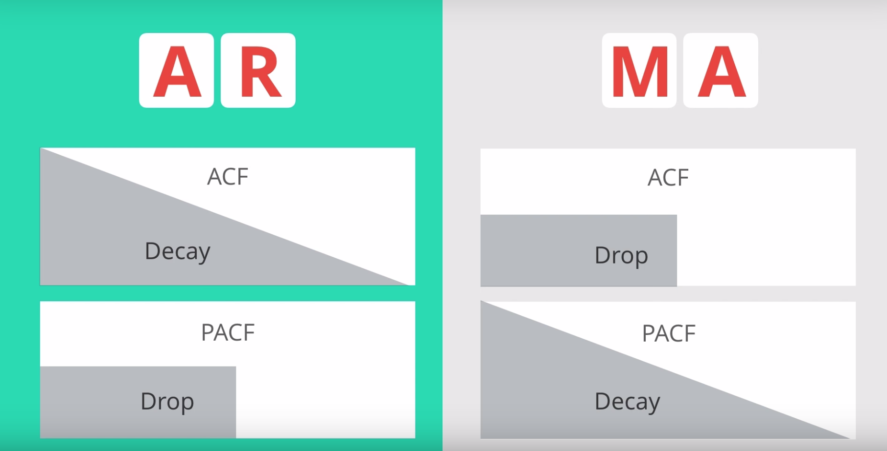
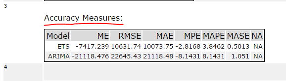

# Time Series Forecasting Explained

> Learning notes of [Time Series Forecasting](https://classroom.udacity.com/courses/ud980) from Udacity

<!-- START doctoc generated TOC please keep comment here to allow auto update -->
<!-- DON'T EDIT THIS SECTION, INSTEAD RE-RUN doctoc TO UPDATE -->
**Table of Contents**

- [Fundamentals of Time Series Forecasting](#fundamentals-of-time-series-forecasting)
- [ETS Models](#ets-models)
  - [Time Series Scenarios](#time-series-scenarios)
  - [Possible scenarios](#possible-scenarios)
  - [ETS Models (Exponential Smoothing Models)](#ets-models-exponential-smoothing-models)
    - [Simple Exponential Smoothing Explained](#simple-exponential-smoothing-explained)
      - [Choosing the correct smoothing parameter is often an iterative process.](#choosing-the-correct-smoothing-parameter-is-often-an-iterative-process)
    - [Time Series Decomposition Plot](#time-series-decomposition-plot)
    - [Double Exponential Smoothing (Holt's Linear Trend Method)](#double-exponential-smoothing-holts-linear-trend-method)
    - [Exponential Trend Method](#exponential-trend-method)
    - [Damped Trend Method](#damped-trend-method)
    - [Holt-Winters Seasonal Method](#holt-winters-seasonal-method)
  - [Summary of four ETS Models](#summary-of-four-ets-models)
  - [Extension of ETS](#extension-of-ets)
- [ARIMA Models](#arima-models)
  - [ARIMA](#arima)
    - [Autocorrelation](#autocorrelation)
    - [Autocorrelation Plot / Correlogram](#autocorrelation-plot--correlogram)
    - [Partial Autocorrelation](#partial-autocorrelation)
    - [How to choose `AR` or `MA` Models?](#how-to-choose-ar-or-ma-models)
    - [Steps to build an ARIMA Model](#steps-to-build-an-arima-model)
  - [Seasonal ARIMA](#seasonal-arima)
- [Interpreting Measures of Error](#interpreting-measures-of-error)
  - [Scale Dependent Errors](#scale-dependent-errors)
  - [Percentage Errors](#percentage-errors)
  - [Scale-Free Errors](#scale-free-errors)
- [References](#references)

<!-- END doctoc generated TOC please keep comment here to allow auto update -->


## Fundamentals of Time Series Forecasting


**Naive Methods**

1. Average Method: The best predictor of what will happen tomorrow is the average of everything that has happened until now
2. Moving Average
3. Seasonal Naive Method: Assumes that the magnitude of the seasonal pattern will remain constant


**Time Series Components**

- Trend (Up-trend, Down-trend, Horizontal-trend)
- Seasonal pattern
- Cyclicla pattern
- Data


<div align="center">
  
</div>


## ETS Models

### Time Series Scenarios

The possible time series (TS) scenarios can be recognized by asking the following questions:

1. TS has a **trend**?
   - If yes, is the trend increasing linearly or exponentially?
2. TS has **seasonality**?
   - If yes, do the seasonal components increase in magnitude over time?


### Possible scenarios

Therefore the scenarios could be:

- No-Trend, No-Seasonal
- No-Trend, Seasonal-Constant
- No-Trend, Seasonal-Increasing

------

- Trend-Linear, No-Seasonal
- Trend-Linear, Seasonal-Constant
- Trend-Linear, Seasonal-Increasing

------

- Trend-Exponential, No-Seasonal
- Trend-Exponential, Seasonal-Constant
- Trend-Exponential, Seasonal-Increasing

As you can see there are nine possible scenarios.


### ETS Models (Exponential Smoothing Models)

We are going to explore four ETS models that can help forecast these possible time-series scenarios.

1. Simple Exponential Smoothing Method
2. Holt's Linear Trend Method
3. Exponential Trend Method
4. Holt-Winters Seasonal Method


#### Simple Exponential Smoothing Explained

For simple exponential smoothing methods, the forecast is calculated by multiplying past values by relative weights, which are calculated based upon what is termed a smoothing parameter. You’ll also hear this called the alpha or $\alpha$. This is the magnitude of the weight applied to the previous values, with the **weights decreasing exponentially as the observations get older**. The formula looks like this:

$$
\text { Forecast }=\text { Weight }_{\mathrm{t}} Y_{\mathrm{t}}+\text { Weight }_{\mathrm{t}-1} Y_{\mathrm{t}-1}+\text { Weight }_{\mathrm{t}-2} \mathrm{Y}_{\mathrm{t}-2}+\ldots+(1-\mathrm{\alpha})^{\mathrm{n}} \mathrm{Y}_{\mathrm{n}}
$$

where

- $t$ is the number of time periods before the most recent period (e.g. $t=0$for the most recent time period, $t=1$ for the time period before that).

- $Y_t$ = actual value of the time series in period $t$

- $\text { Weight }_{\mathrm{t}} = \alpha (1-\alpha)t$

- $n$ = the total number of time periods

This model basically gives us a smooth line or **LEVEL** in our forecast that we can use to forecast the next period.


Here are a few key points to help understand the **smoothing parameter**:

- The smoothing parameter can be set for *any value between 0 and 1*.
- If the smoothing parameter is *close to one*, <u>more recent observations carry more weight or influence over the forecast</u> (if $\alpha$ = 0.8, weights are 0.8, 0.16, 0.03, 0.01, etc.).
- If the smoothing parameter is *close to zero*, <u>the influence or weight of recent and older observations is more balanced</u> (if $\alpha$ = 0.2, weights are 0.2, 0.16, 0.13, 0.10, etc.).


##### Choosing the correct smoothing parameter is often an iterative process.

The advantage of exponential smoothing methods over simple moving averages is that new data is depreciated at a constant rate, gradually declining in its impact, whereas the impact of a large or small value in a moving average, will have a constant impact. However, this also means that exponential smoothing methods are more sensitive to sudden large or small values.

The simple exponential smoothing method **does not account for any trend or seasonal components**, rather, it only uses the decreasing weights to forecast future results. This makes the method suitable **only for time series without trend and seasonality**.


#### Time Series Decomposition Plot

Seasonality, Trend and Error component


1. Additive Model: useful when the trend and seasonal variation are relatively constant over time (linear)
2. Multiplicative Model: useful when the trend and season variation increases or decreases in magnitude over time (exponetial)


#### Double Exponential Smoothing (Holt's Linear Trend Method)

Non Seasonal, Uptrend or Downtrend and the trend in linear


#### Exponential Trend Method

Trend is exponential


#### Damped Trend Method

Dampen the trend line into a flat line

damp parameter $\Phi$, if $\Phi$ is small, trend changing slow, else trend changing rapidly.


#### Holt-Winters Seasonal Method

Trend with Seasonality


### Summary of four ETS Models

There are several methods we need to pick in order to model any given time series appropriately:

1. **Simple Exponential Smoothing**
   - Finds the level of the time series
2. **Holt's Linear Trend**
   - Finds the level of the time series
   - Additive model for <u>linear trend</u>
3. **Exponential Trend**
   - Finds the level of the time series
   - Multiplicative model for <u>exponential trend</u>
4. **Holt-Winters Seasonal**
   - Finds the level of the time series
   - Additive for trend
   - Multiplicative and Additive for <u>seasonal components</u>


These methods help deal with different scenarios in our time series involving:

1. Linear or exponential trend
2. Constant or increasing seasonality components


For trends that are *exponential*, we would need to use a **multiplicative** model.

For *increasing seasonality components*, we would need to use a **multiplicative model** model as well.


### Extension of ETS

We can generalize all of these models using a naming system for ETS:

```
ETS (Error, Trend, Seasonality)
```


`Error` is the error line we saw in the time series decomposition part earlier in the course. If the <u>error is increasing similar to an increasing seasonal components</u>, we would need to consider a <u>multiplicative design for the exponential model</u>.

Therefore, for each component in the ETS system, we can assign `None`, `Multiplicative`, or `Additive` (or `N`, `M`, `A`) for each of the three components in our time series.


Examples

- A time series model that has a **constant error**, **linear trend**, and **increasing seasonal components** means we would need to use an ETS model of: `ETS(A, A, M)`
- A time series model that has **increasing error**, **exponential trend**, and **no seasonality** means we would need to use an ETS model of: `ETS(M, M, N)`
- A time series model has **increasing error**, **no trend**, and **constant seasonal components**. What would the corresponding ETS model be? `ETS(M, N, A)`


## ARIMA Models

- ARIMA
- Seasonal ARIMA


**Differencing**

Differencing is a method of <u>transforming a non-stationary time series to a stationary one</u>. This is an important step in preparing data to be used in an ARIMA model.

Almost by definition, it may be necessary to examine differenced data when we have seasonality. Seasonality usually causes the series to be nonstationary because the average values at some particular times within the seasonal span (months, for example) may be different than the average values at other times. For instance, our sales of cooling fans will always be higher in the summer months.

- **Seasonal differencing**

  Seasonal differencing is defined as a difference between a value and a value with lag that is a multiple of *S*.With *S* = 12, which may occur with monthly data, a seasonal difference is (1−B12)xt=xt−xt−12.The differences (from the previous year) may be about the same for each month of the year giving us a stationary series.With *S* = 4, which may occur with quarterly data, a seasonal difference is (1−B4)xt=xt−xt−4*.*Seasonal differencing removes seasonal trend and can also get rid of a seasonal random walk type of nonstationarity.

- **Non-seasonal differencing**

  If trend is present in the data, we may also need non-seasonal differencing. Often (not always) a first difference (non-seasonal) will “detrend” the data. That is, we use (1−B)xt=xt−xt−1 in the presence of trend.

- **Differencing for Trend and Seasonality**

  When both trend and seasonality are present, we may need to apply both a non-seasonal first difference and a seasonal difference.That is, we may need to examine the ACF and PACF of (1−B12)(1−B)xt=(xt−xt−1)−(xt−12−xt−13).Removing trend doesn't mean that we have removed the dependency. We may have removed the mean, μt, part of which may include a periodic component. In some ways we are breaking the dependency down into recent things that have happened and long-range things that have happened.


**Differencing and the $I$ Term of ARIMA**

The <u>number of times</u> of differencing needed to render the series stationary will be the differenced `I(d)` term in our ARIMA model.

The best way to determine whether or not the series is sufficiently differenced is to **plot the differenced series and check to see if there is a constant mean and variance**.


### ARIMA

- `AR(p)` : number of periods of the time series used in the calculation
- `I(d)` : process used to transform a time series into a stationary one
- `MA(q)` : lags of error component


#### Autocorrelation

Autocorrelation is "How correlated a time series is with its past values"


#### Autocorrelation Plot / Correlogram

This is used to see the correlation between the points up to and including our lag unit


#### Partial Autocorrelation

Partial Autocorrelation is "The correlation between 2 variables controlling for the values of another set of variables"


#### How to choose `AR` or `MA` Models?





#### Steps to build an ARIMA Model

- **Step 1 - Check stationarity:** If a time series has a trend or seasonality component, it must be made stationary before we can use ARIMA to forecast. Use the <u>TS Plot</u> tool to see if the time series is stationary.
- **Step 2 - Difference:** If the time series is not stationary, it needs to be stationarized through differencing. Take the first difference, then check for stationarity. Take as many differences as it takes. Make sure you check seasonal differencing as well.
- **Step 3 - Filter out a validation sample:** This will be used to validate how accurate our model is. Use the last 6 periods as the validation sample.
- **Step 4 - Select AR and MA terms:** Use the ACF and PACF to decide whether to include an AR term(s), MA term(s), or both.
- **Step 5 - Build the model:** Build the model and set the number of periods to forecast to 6.
- **Step 6 - Validate model:** Compare the predicted values to the actuals in the validation sample.


### Seasonal ARIMA

The seasonal ARIMA model incorporates both non-seasonal and seasonal factors in a multiplicative model. One shorthand notation for the model is
$$
\text{ARIMA}(p, d, q) \times(P, D, Q) S
$$
with

- $p$ = non-seasonal AR order,
- $d$ = non-seasonal differencing,
- $q$ = non-seasonal MA order,
- $P$ = seasonal AR order,
- $D$ = seasonal differencing,
- $Q$ = seasonal MA order,
- and $S$ = time span of repeating seasonal pattern.


## Interpreting Measures of Error

### Scale Dependent Errors

Scale dependent errors, such as mean error (ME) mean percentage error (MPE), mean absolute error (MAE) and root mean squared error (RMSE), are based on a set scale, which for us is our time series, and cannot be used to make comparisons that are on a different scale. For example, we wouldn’t take these error values from a time series model of the sheep population in Scotland and compare it to corn production forecast in the United States.

- **Mean Error (ME)** shows the average of the difference between actual and forecasted values.
- **Mean Percentage Error (MPE)** shows the average of the percent difference between actual and forecasted values. Both the ME and MPE will help indicate whether the forecasts are biased to be disproportionately positive or negative.
- **Root Mean Squared Error (RMSE)** represents the sample standard deviation of the differences between predicted values and observed values. These individual differences are called residuals when the calculations are performed over the data sample that was used for estimation, and are called prediction errors when computed out-of-sample. This is a great measurement to use when comparing models as it shows how many deviations from the mean the forecasted values fall.
- **Mean Absolute Error (MAE)** takes the sum of the absolute difference from actual to forecast and averages them. It is less sensitive to the occasional very large error because it does not square the errors in the calculation.

### Percentage Errors

Percentage errors, like MAPE, are useful because they are scale independent, so they can be used to compare forecasts between different data series, unlike scale dependent errors. The disadvantage is that it cannot be used if the series has zero values.

- **Mean Absolute Percentage Error (MAPE)** is also often useful for purposes of reporting, because it is expressed in generic percentage terms it will make sense even to someone who has no idea what constitutes a "big" error in terms of dollars spent or widgets sold.

### Scale-Free Errors

Scale-free errors were introduced more recently to offer a scale-independent measure that doesn't have many of the problems of other errors like percentage errors.

- **Mean Absolute Scaled Error (MASE)** is another relative measure of error that is applicable only to time series data. It is defined as the mean absolute error of the model divided by the the mean absolute value of the first difference of the series. Thus, it measures the relative reduction in error compared to a naive model. Ideally its value will be significantly less than 1 but is relative to comparison across other models for the same series. Since this error measurement is relative and can be applied across models, it is accepted as one of the best metrics for error measurement.

To read a bit more of the subject, see [this 4-page paper](http://robjhyndman.com/papers/foresight.pdf) by Rob Hyndman, Statistics professor at Monash University in Australia.


In Alteryx you can find these measures in the ARIMA or ETS tools labelled as In-sample error measures. Example below:


When you forecast values using ARIMA and ETS and compare these forecasted results in the TS Compare tool you will find these measures in the Accuracy Measures section. Example below:





## References

[1] [Time Series Forecasting](https://classroom.udacity.com/courses/ud980) from Udacity  
[2] [STAT 510](https://newonlinecourses.science.psu.edu/stat510/) Applied Time Series Analysis at PennState 