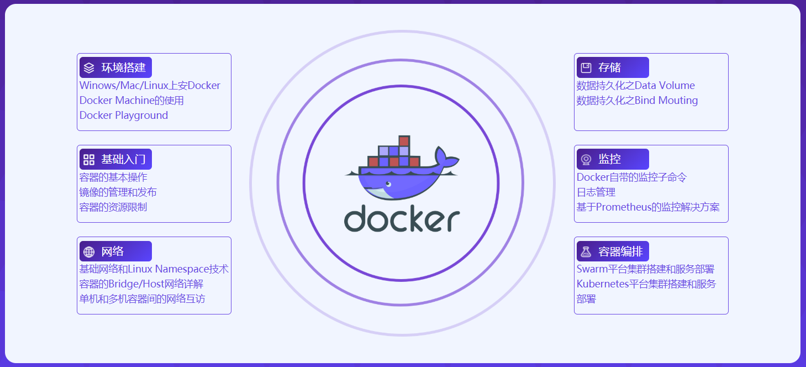

# 慕课网: 系统学习 Docker 践行 DevOps 理念 - 课程笔记




[TOC]

**目录**

1. 容器技术和 Docker 简介
1. Docker 的镜像和容器
1. Docker 的网络
1. Docker 的持久化存储和数据共享
1. Docker Compose 多容器部署
1. 容器编排 Docker Swarm
1. DevOps 初体验 - Docker Cloud 和 Docker 企业版
1. 容器编排 Kubernetes
1. 容器运维和监控
1. Docker DevOps 实战 - 过程以及工具
1. 总结


> 建议先阅读我写的[这篇](https://zhenye-na.github.io/2019/09/29/docker-practical-guide.html)笔记, 不然会不知所云
>
> https://zhenye-na.github.io/2019/09/29/docker-practical-guide.html


## 1. 容器技术和 Docker 简介

虚拟化技术的优点

- 资源池 - 一个物理机的资源被分配到不同的虚拟机里
- 易扩展 - 直接增加物理机或者虚拟机即可
- 易上云 - AWS, GCP, 阿里云等


但是虚拟化具有一定的局限性: 虚拟机是一个完整的操作系统, 需要分配资源, 当虚拟机数量增多时, 操作系统本身消耗的资源势必增多

那么使用容器解决了什么问题呢?


- 解决了开发和运维的矛盾
- 在开发和运维之间搭建桥梁, 帮助实现 DevOps


容器的定义:

- 对软件和其依赖的标准化打包
- 应用之间的相互隔离
- 共享同一个 OS Kernel
- 可以运行在很多主流 OS 上

<div align="center">
  
</div>

> Docker Machine: 自动在虚拟机上安装 Docker 环境的工具


## 2. Docker 的架构和底层技术


### Docker Image 概述


什么是 Docker Image?

- 文件和 meta data 的集合 (root filesystem)
- 文件分层. 并且每一层都可以添加改变删除文件, 成为一个新的 image
- 不同的 image 可以共享相同的 layer
- Image 是 **read only** 的

<div align="center">
  
</div>


### Image 获取方式

1. Dockerfile
2. Pull from Registry / DockerHub


```sh
$ docker version
# 查看 docker version

$ docker image ls
# 列出 docker 里的镜像

$ docker pull <image_name>
# 拉取 docker 镜像
```


#### 如何制作一个镜像

```sh
# 添加账号进入用户组, 否则需要一直 sudo

# 重启 docker 进程
$ sudo service docker restart
```

```dockerfile
FROM scratch
ADD hello /
CMD ["/hello"]
```

构件一个 Image

```sh
$ docker build -t <tag_name> .
```

查看 docker image 命令记录

```sh
$ docker history <image_id>
```

运行

```sh
$ docker run <tag_name>
```


### Docker Container 概述

- 通过 Docker Image 创建 Container
- 在 Image Layer 之上建立一个可以读写的 Container Layer
- Image 负责 app 的存储和分发, Container 负责运行 app


```sh
$ docker container ls -a

$ docker run centos -it
# -i : interactive
# -t : tty, allocate a pseudo-TTY
```

其他的一些命令

- management commands
- commands

```sh
$ docker container rm <container_id>

$ docker rm <container_id>

$ docker rmi <image_id>
```


#### 构建一个 Container

相关命令

```sh
$ docker conatiner commit <arg>
# commit 一个 container

$ docker image build <arg>
# Build an image from a Dockerfile
```


比较简单但是不安全的做法就是, 比如你想发布一个带有 `vim` 的 centos 镜像. 你可以直接 pull 一个 centos 在里面安装 vim 然后发布, 但是怕就怕在一但讲什么重要的文件也发布出去就尴尬了, 所以我们可以用 `dockerfile` 来直接制作

```dockerfile
FROM centos
RUN yum install -y vim
```

```sh
$ docker build -t <name>
```


### Dockerfile 语法梳理及最佳实践


**`FROM`**

- `FROM scratch` # 制作 base image
- `FROM centos`  # 使用 base image
- `FROM ubuntu:14.04`

> 当然 尽量使用官方的 image 作为 base image


**`LABEL`**

描述一些 metadata 的信息

- `LABEL maintainer=""`
- `LABEL version=`
- `LABEL description=`


**`RUN`**

运行命令

```dockerfile
RUN yum update && yum install -y vim \
    python-dev
```


**`WORKDIR`**

工作目录

```
WORKDIR /root

WORKDIR /test # 如果没有会创建 test 目录
RUN pwd
# 结果就是 /test
```


**`ADD` 和 `COPY`**

```
ADD hello /

ADD test.tar.gz / # 添加并且解压
```

对于 ADD 和 COPY, 大部分情况, COPY 优于 ADD, ADD 除了 COPY 还有**解压**这个功能, 添加远程文件/目录, 尽量使用 `curl` 或者 `wget`


**`ENV`**

```dockerfile
ENV MYSQL_VERSION 5.6
RUN apt-get install -y mysql-server="${MYSQL_VERSION}" \
    && rm -rf /var/lib/apt/lists/*   # 引用常量
```


**`VOLUME` 和 `EXPOSE`**


### RUN vs CMD vs ENTRYPOINT


- `RUN` 执行命令并创建新的 `Image Layer`
- `CMD` 设置容器启动后默认执行的命令和参数
- `ENTRYPOINT` 设置容器启动时运行的命令


#### shell 和 exec 格式


- shell 格式

  - ```dockerfile
    RUN apt-get install -y vim
    CMD echo "hello docker"
    ENTRYPOINT echo "bye"
    ```

- exec 格式

  - ```dockerfile
    RUN ["apt-get", "install", "-y", "vim" ]
    CMD ["/bin/echo", "hello docker" ]
    ENTRYPOINT [ "/bin/echo", "bye" ]
    ```

  - ```dockerfile
    FROM centos
    ENV NAME Docker
    ENTRYPOINT [ "/bin/bash", "-c", "echo hello $NAME" ]
    ```


#### CMD


1. 容器启动时默认执行的命令
2. 如果 `docker run` 制定了其他的命令, 那么 `CMD` 会被忽略
3. 如果定义了多个 `CMD` 只有最后一个会执行


#### ENTRYPOINT


1. 让容器以应用程序或者服务的形式运行
2. 不会被忽略, 一定会执行
3. 最佳实践: 写一个 shell 脚本


> 使用较多


### 发布镜像


- 带着自己的 dockerhub username
- `docker login`
- `docker push <image_name>`

- dockerhub -> automated build


### 容器的相关操作


进入到 Container 里面操作

```bash
$ docker exec -it <container_id> /bin/bash
```


停止 Container 运行

```shell
$ docker stop <container_id>
```


返回 json 形式的 docker container 信息

```shell
$ docker inspect <container_id>
```


返回 container 运行中产生的 logs

```bash
$ docker logs <container_id>
```


### Dockerfile 小实践


```dockerfile
FROM ubuntu
RUN apt-get update && apt-get upgrade && apt-get install -y stress
ENTRYPOINT ["/usr/bin/stress"]
CMD []
```


这样在使用的时候, vm 等的参数可以被传入 (相当于添加到 CMD)


### 容器的资源限制


> 比如说限制 container 内存的大小等


限制内存

```
- memory
- memory-swap

设置了 memory 但是没有设置 swap-memory -> swap memory 大小和设置的 memory 大小相等
```


限制 CPU

```
- cpu-shares   (relative weight)
```


## 3. Docker 的网络

- 单机
  - Bridge Network
  - Host Network
  - None Network
- 多机
  - Overlay Network


### 基础网络概念

基于数据包的通信方式

网络分层


#### 一些概念和工具


公有IP 和 私有 IP

- Public IP: 互联网上的唯一标识, 可以访问互联网
- Private IP: 不可以在互联网上使用, 仅供内部使用


ping 和 telnet

- ping 检查 IP 的可达性
- tenet 检查服务的可用性


#### Linux 的网络命名空间


```bash
$ ip a
```


创建 container 会生成 name space


#### Docker Bridge 网络


```bash
$ docker network ls
```

两个可以通信的 container 可以通过 `veth` 对 通过 `docker0` 链接.


##### 针对单个 docker container 是如何访问网络的

通过 NAT 技术 链接 eth0 , 形成 linux 主机数据包, 链接外网


#### Docker 之间的 link

> 例子: 给数据库容器起一个名字, 然后直接用名字访问该容器

```bash
$ docker run -d --name test2 --link test1 busybox /bin/sh -c "while true; do sleep; done"

$ docker exec -it test2 /bin/sh

$ ping test1 # 可以 ping 通
# 只需要知道名字, 不需要知道 ip 地址
```


创建一个 bridge 并将新的容器连接

```bash
$ docker network create -d bridge my-bridge

$ docker network ls

$ docker run -d --name test2 --network my-bridge busybox /bin/sh -c "while true; do sleep; done"

$ docker network inspect <network_id>
```


如何将之前已经创建好的容器连接到新创建的 bridge 呢?

```bash
$ docker network connect
"docker network connect" requires exactly 2 arguments.
See 'docker network connect --help'.

Usage:  docker network connect [OPTIONS] NETWORK CONTAINER

Connect a container to a network

$ docker network connect my-bridge test1
```


`test1` 和 `test2` 都连接到用户自己创建的 bridge, 那么在 test1 中可以通过 `ping test2` , 相当于已经做好了 `--link test2` 这个操作


### 容器网络 host 和 none


#### none

```bash
$ docker run -d --name test2 --network none busybox /bin/sh -c "while true; do sleep; done"
```

孤立的 network namespace


一个模块一个容器


### 多机器通信


在不同 Linux 宿主机的 docker 容器通信


## Docker 持久化存储和数据共享

容器是临时存储和保存数据, 一旦删除, 数据都会被删除


**Docker 持久化数据的方案**

1. <u>基于本地文件系统的 Volume</u>. 可以执行 `Docker create` 或者 `Docker run` 时, 通过 `-v` 参数将主机的目录作为容器的数据卷. 这部分功能便是基于本地文件系统的 volume 管理
2. <u>基于 plugin 的 Volume</u>. 支持第三方的存储方案, 比如 AWS


Volume 的类型

1. 受管理的 data volume, 由 docker 后台自动创建
2. 绑定挂载的 volume, 具体挂载位置可以由用户指定


### 数据持久化: Data Volume

举例

```bash
$ docker run -d --name mysql1 -e MYSQL_ALLOW_EMPTY_PASSWORD=true mysql

$ docker volume ls

$ odcker volume inspect

$ docker volume rm <volume_id>
```


在 Dockerfile 中指定

```bash
VOLUME ["/var/lib/mysql"]
```


在命令行中 (推荐)

```bash
$ docker run -v mysql:/var/lib/mysql
#               宿主机:docker 容器内
```


### 数据持久化: Bind Mounting

修改会同步, 双向

```bash
$ docker run -v /home/aaa:/root/aaa
```

将容器内的文件映射到宿主机上, 并且双向同步


## Docker compose 介绍

多容器的 APP 部署十分繁琐

- docker build image 或者 从 dockerhub 拉取
- 创建多个 container
- 要管理这些 container (启动停止删除等)


Docker compose 就类似于 "批处理"

- 是一个基于命令行的批处理工具
- 可以通过一个 yml 文件定义多容器的 docker 应用
- 通过一条命令节可以根据 yml 文件的定义去创建或者管理多个容器


`docker-compose.yml`

- Services
- Networks
- Volumes


#### Services

- 一个 service 代表一个 container, 这个 container 可以从 dockerhub 的 image 创建, 或者从本地的 Dockerfile build 出来的 image 来创建
- Service 启动类似于 docker run, 我们可以给其指定 network 和 volume, 所以可以 service 指定 network 和 volume 的引用


举个简单的例子

```yml
services:
  db:
    image: postgres:9.4
    volumes:
      - "db-data:/var/lib/postgresql/data"
    networks:
      - back-tier
```

作用等同于下面这条命令

```bash
$ docker run -d --network back-tier -v db-data:/var/lib/postgresql/data postgres:9.4
```


```bash
$ docker-compose up --scale

# scale SERVICES to NUM instances
```


## Docker Swarm 容器编排


Service 和 Replicas


服务创建和调度流程


### 实践: 创建一个三节点的 Docker Swarm 集群


创建宿主机环境的方法

- Vagrant + Virtual Box
- Docker Machine + Virtual Box
- Play with Docker


```bash
$ docker swarm init --advertise-addr
# 要在 manager 机器上运行, 运行完事后 就变成了 manager 节点

$ docker swarm join --token <token> <advertise-addr:port>
# 上一步操作会生成一段命令, 复制在 worker 机器上运行即可

$ docker node ls
# list nodes in the swarm
```


### Service 的创建维护和水平扩展


```bash
$ docker service scale SERVICE=REPLICAS

$ docker service ls
```


### Swarm 集群通过 Service 进行部署


```bash
$ docker service create --name mysql --env MYSQL_ROOT_PASSWORD=root \
    --env MYSQL_DATABASE=wordpress \
    --network demo \
    --mount type=volume,source=mysql-data,destination=/var/lib/mysql \
    mysql
```


```bash
$ docker service create --name wordpress -p 80:80 \
    --env WORKDPRESS_DB_PASSWORD=root \
    --env WORDPRESS_DB_HOST=mysql \
    --network demo \
    wordpress
```


```bash
$ docker service ps wordpress
```


### 集群服务间通信之 Routing Mesh


## References


