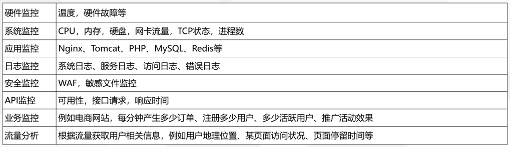
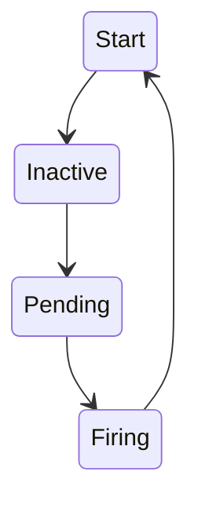
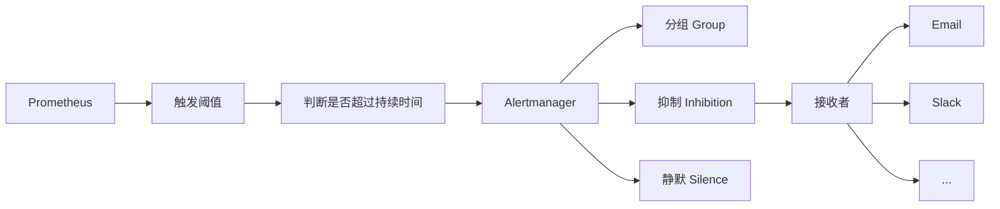

# Prometheus + Grafana | 全方位立体式监控系统学习笔记


**目录**

- 监控基本概述
- Prometheus 概述
- Prometheus 部署方式
- 配置文件与核心功能
- 监控案例
- 告警组件 AlertManager 概述
- 全方位监控 Kubernetes 资源与应用


## 监控基本概述


我们为什么要进行监控？

- 对系统不间断实时监控
  - 自动发现问题，自动告警
  - 对底层架构进行监控
- 实时反馈系统当前状态
  - 服务器等组建的运行状态
  - 直观发现问题
- 保证业务持续性运行


监控的基本方式

- 监控工具
  - top
  - df
  - free
  - vmstat
- 监控系统
  - Zabbix (不是很适合容器系统)
  - Prometheus
  - Open-Falcon


准备工作

- 熟悉被监控对象
- 整理监控指标
- 告警阈值定义
- 故障处理流程





## Prometheus 基本概述

### Prometheus 的一些特点

- 多维数据模型：由<u>度量名称</u>和<u>键值对标识的时间序列</u>数据
- `PromSQL`：一种灵活的查询语言，可以利用多维数据完成复杂的查询
- 不依赖分布式存储，单个服务器节点可直接工作
- 基于 `HTTP` 的 `pull` 方式采集时间序列数据
- 推送时间序列数据通过 `PushGateway` 组件支持
- 通过服务发现或静态配置发现目标
- 多种图形模式及仪表盘支持 (grafana)


### Prometheus 组成及架构


- Prometheus Server：收集**指标和存储时间序列**数据，并**提供查询接口**
- Client Library：客户端库
- Push Gateway：短期存储指标数据。主要用于**临时性的任务**
- Exporters：采集已有的第三方服务监控指标并暴露 metrics
- Alertmanager：告警功能
- Web UI：简单的 Web 控制台


### 数据模型

所有数据存储为**时间序列** (Time Series)，具有相同度量名称以及标签属于同一个指标

每个时间内序列都由度量标准名称和一组键值对（标签）- 唯一标识


### 指标类型

- Counter：递增的计数器，比如 API 请求次数
- Gauge：可以任意变化的数值，比如 CPU 内存利用率变化
- Histogram：对一段时间范围内数据进行采样，并对所有数值*求和*与*统计数量*
- Summary：与 Histogram 类似


## Prometheus 配置文件与核心功能

### 全局配置文件


```yaml
global:
  # How frequently to scrape targets by default.
  [ scrape_interval: <duration> | default = 1m ]

  # How long until a scrape request times out.
  [ scrape_timeout: <duration> | default = 10s ]

  # How frequently to evaluate rules.
  [ evaluation_interval: <duration> | default = 1m ]

  # The labels to add to any time series or alerts when communicating with
  # external systems (federation, remote storage, Alertmanager).
  external_labels:
    [ <labelname>: <labelvalue> ... ]

# Rule files specifies a list of globs. Rules and alerts are read from
# all matching files.
rule_files:
  [ - <filepath_glob> ... ]

# A list of scrape configurations.
scrape_configs:
  [ - <scrape_config> ... ]

# Alerting specifies settings related to the Alertmanager.
alerting:
  alert_relabel_configs:
    [ - <relabel_config> ... ]
  alertmanagers:
    [ - <alertmanager_config> ... ]

# Settings related to the remote write feature.
remote_write:
  [ - <remote_write> ... ]

# Settings related to the remote read feature.
remote_read:
  [ - <remote_read> ... ]
```


### scrape_configs

```yaml
# The job name assigned to scraped metrics by default.
job_name: <job_name>

# How frequently to scrape targets from this job.
[ scrape_interval: <duration> | default = <global_config.scrape_interval> ]

# Per-scrape timeout when scraping this job.
[ scrape_timeout: <duration> | default = <global_config.scrape_timeout> ]

# The HTTP resource path on which to fetch metrics from targets.
[ metrics_path: <path> | default = /metrics ]

# honor_labels controls how Prometheus handles conflicts between labels that are
# already present in scraped data and labels that Prometheus would attach
# server-side ("job" and "instance" labels, manually configured target
# labels, and labels generated by service discovery implementations).
#
# If honor_labels is set to "true", label conflicts are resolved by keeping label
# values from the scraped data and ignoring the conflicting server-side labels.
#
# If honor_labels is set to "false", label conflicts are resolved by renaming
# conflicting labels in the scraped data to "exported_<original-label>" (for
# example "exported_instance", "exported_job") and then attaching server-side
# labels.
#
# Setting honor_labels to "true" is useful for use cases such as federation and
# scraping the Pushgateway, where all labels specified in the target should be
# preserved.
#
# Note that any globally configured "external_labels" are unaffected by this
# setting. In communication with external systems, they are always applied only
# when a time series does not have a given label yet and are ignored otherwise.
[ honor_labels: <boolean> | default = false ]

# honor_timestamps controls whether Prometheus respects the timestamps present
# in scraped data.
#
# If honor_timestamps is set to "true", the timestamps of the metrics exposed
# by the target will be used.
#
# If honor_timestamps is set to "false", the timestamps of the metrics exposed
# by the target will be ignored.
[ honor_timestamps: <boolean> | default = true ]

# Configures the protocol scheme used for requests.
[ scheme: <scheme> | default = http ]

# Optional HTTP URL parameters.
params:
  [ <string>: [<string>, ...] ]

# Sets the `Authorization` header on every scrape request with the
# configured username and password.
# password and password_file are mutually exclusive.
basic_auth:
  [ username: <string> ]
  [ password: <secret> ]
  [ password_file: <string> ]

# Sets the `Authorization` header on every scrape request with
# the configured bearer token. It is mutually exclusive with `bearer_token_file`.
[ bearer_token: <secret> ]

# Sets the `Authorization` header on every scrape request with the bearer token
# read from the configured file. It is mutually exclusive with `bearer_token`.
[ bearer_token_file: /path/to/bearer/token/file ]

# Configures the scrape request's TLS settings.
tls_config:
  [ <tls_config> ]

# Optional proxy URL.
[ proxy_url: <string> ]

# List of Azure service discovery configurations.
azure_sd_configs:
  [ - <azure_sd_config> ... ]

# List of Consul service discovery configurations.
consul_sd_configs:
  [ - <consul_sd_config> ... ]

# List of DNS service discovery configurations.
dns_sd_configs:
  [ - <dns_sd_config> ... ]

# List of EC2 service discovery configurations.
ec2_sd_configs:
  [ - <ec2_sd_config> ... ]

# List of OpenStack service discovery configurations.
openstack_sd_configs:
  [ - <openstack_sd_config> ... ]

# List of file service discovery configurations.
file_sd_configs:
  [ - <file_sd_config> ... ]

# List of GCE service discovery configurations.
gce_sd_configs:
  [ - <gce_sd_config> ... ]

# List of Kubernetes service discovery configurations.
kubernetes_sd_configs:
  [ - <kubernetes_sd_config> ... ]

# List of Marathon service discovery configurations.
marathon_sd_configs:
  [ - <marathon_sd_config> ... ]

# List of AirBnB's Nerve service discovery configurations.
nerve_sd_configs:
  [ - <nerve_sd_config> ... ]

# List of Zookeeper Serverset service discovery configurations.
serverset_sd_configs:
  [ - <serverset_sd_config> ... ]

# List of Triton service discovery configurations.
triton_sd_configs:
  [ - <triton_sd_config> ... ]

# List of labeled statically configured targets for this job.
static_configs:
  [ - <static_config> ... ]

# List of target relabel configurations.
relabel_configs:
  [ - <relabel_config> ... ]

# List of metric relabel configurations.
metric_relabel_configs:
  [ - <relabel_config> ... ]

# Per-scrape limit on number of scraped samples that will be accepted.
# If more than this number of samples are present after metric relabelling
# the entire scrape will be treated as failed. 0 means no limit.
[ sample_limit: <int> | default = 0 ]
```


### relabel_configs

允许在数据采集之前对任何**目标及标签**进行修改

重新标签有什么意义？

- 重命名标签名
- 删除标签
- 过滤目标


```yaml
# The source labels select values from existing labels. Their content is concatenated
# using the configured separator and matched against the configured regular expression
# for the replace, keep, and drop actions.
[ source_labels: '[' <labelname> [, ...] ']' ]

# Separator placed between concatenated source label values.
[ separator: <string> | default = ; ]

# Label to which the resulting value is written in a replace action.
# It is mandatory for replace actions. Regex capture groups are available.
[ target_label: <labelname> ]

# Regular expression against which the extracted value is matched.
[ regex: <regex> | default = (.*) ]

# Modulus to take of the hash of the source label values.
[ modulus: <uint64> ]

# Replacement value against which a regex replace is performed if the
# regular expression matches. Regex capture groups are available.
[ replacement: <string> | default = $1 ]

# Action to perform based on regex matching.
[ action: <relabel_action> | default = replace ]
```


`action`：重新标签动作

- `replace`：*默认*，通过 regex 匹配 `source_label` 的值，使用 replacement 来引用表达式匹配的分组
- `keep`：删除 regex 与连接不匹配的目标 `source_labels` (保留匹配的)
- `drop`：删除 regex 与连接匹配的目标 `source_labels` (保留不匹配的)
- `labeldrop`：删除 regex 匹配的标签
- `labelkeep`：删除 regex 不匹配的标签
- `hashmod`：设置 `target_label` 为 modulus 连接的哈希值 `source_labels`
- `labelmap`：匹配 regex 所有标签名称。然后复制匹配标签的值进行分组，replacement 分组引用（`${1}`,`${2}`,…）替代


### 基于文件的服务发现

- azure_sd_configs
- consul_sd_configs
- dns_sd_configs
- ec2_sd_configs
- openstack_sd_configs
- **file_sd_configs**
- gce_sd_configs
- **kubernetes_sd_configs**
- marathon_sd_configs
- nerve_sd_configs
- serverset_sd_configs
- triton_sd_configs


**`file_sd_configs`**

```yaml
# Patterns for files from which target groups are extracted.
files:
  [ - <filename_pattern> ... ]

# Refresh interval to re-read the files.
[ refresh_interval: <duration> | default = 5m ]
```


## 监控案例

### 监控 Linux 服务器

node_exporter：用于 *NIX 系统监控，使用 Go 语言编写的收集器


### 监控 CPU 内存 硬盘

CPU使用率：

```
100 - (avg(irate(node_cpu_seconds_total{mode="idle"}[5m])) by (instance) * 100)
```


内存使用率：

```
100 - (node_memory_MemFree_bytes+node_memory_Cached_bytes+node_memory_Buffers_bytes) / node_memory_MemTotal_bytes * 100
```


磁盘使用率：

```
100 - (node_filesystem_free_bytes{mountpoint="/",fstype=~"ext4|xfs"} / node_filesystem_size_bytes{mountpoint="/",fstype=~"ext4|xfs"} * 100)
```


## 告警系统 Alertmanager

1. 部署 Alertmanager
2. 配置Prometheus与 Alertmanager 通信
3. 在Prometheus中创建告警规则


### 配置 Prometheus 与 Alertmanager 通信


### 在 Prometheus 中创建告警规则

```yaml
groups:
  - name: example
  rules:
  # Alert for any instance that is unreachable for >5 minutes.
  - alert: InstanceDown
    expr: up == 0
    for: 5m
    labels:
      severity: page
    annotations:
      summary: "Instance {{ $labels.instance }} down"
      description: "{{ $labels.instance }} of job {{ $labels.job }} has been down for more than 5 minutes."
```


检查配置文件

```bash
$ ./promtool checck config prometheus.yml
```


重启 Prometheus

```bash
$ systemctl restart prometheus
```


### 告警状态

- Inactive：什么都没有发生。
- Pending：已<u>触发阈值</u>，但**未**满足告警持续时间
- Firing：已<u>触发阈值</u>且<u>满足告警持续时间</u>。警报发送给接受者。


告警产生到发出是需要一段时间的，不是说满足一定条件就会发送。持续时间是 `for` 这个参数控制的。满足条件后会变成 Pending，持续等待一段时间，如果超过持续时间问题仍然存在，告警才会被以对应方式发送给接收者




### 告警分配


```yaml
route:
    receiver: default-receiver
    group_wait: 30s
    group_interval: 5m
    repeat_interval: 4h
    group_by:
        - cluster
        - alertname
routes:
    -
        receiver: database-pager
        group_wait: 10s
        match_re:
            service: mysql|cassandra
    -
        receiver: frontend-pager
        group_by:
            - product
            - environment
        match:
            team: frontend
receivers:
    -
        name: database-pager
        email_configs:
            - {to: email1@server.com}
    -
        name: frontend-pager
        email_configs:
            - {to: email2@server.com}
```


`route` : 告警分配策略

`group_*` : 邮件分组


### 告警收敛 (分组，抑制，静默)

Alertmanager 的架构图


- 分组 (group)：将类似性质的警报分类为单个通知
  - 减少告警消息数量
  - 聚合同类告警信息
- 抑制 (Inhibition)：当警报发出后，停止重复发送由此警报引发的其他警报
  - 消除冗余告警，只接受高级别的告警
- 静默 (Silences)：是一种简单的特定时间静音提醒的机制


官网上的 Inhibition rules

```yaml
# Inhibition rules allow to mute a set of alerts given that another alert is
# firing.
# We use this to mute any warning-level notifications if the same alert is
# already critical.
inhibit_rules:
- source_match:
    severity: 'critical'
  target_match:
    severity: 'warning'
  # Apply inhibition if the alertname is the same.
  equal: ['alertname']
```


### Prometheus 的告警信息触发机制



## Prometheus 全方位监控 Kubernetes

### K8s 监控方案

- cAdvisor + Heapster + InfluxDB + Grafana
  - 不支持业务监控
  - 扩展性不是很好
- cAdvisor/exporter + Prometheus + Grafana


### K8s 监控指标

Kubernetes本身监控

- Node资源利用率
- Node数量
- Pods数量（Node）
- 资源对象状态

Pod监控

- Pod数量（项目）
- 容器资源利用率
- 应用程序


| 监控指标     | 具体实现           | 举例                       |
| ------------ | ------------------ | -------------------------- |
| Pod 性能     | cAdvisor           | 容器 CPU 内存利用率        |
| Node 性能    | node-exporter      | 节点 CPU 内存利用率        |
| K8s 资源对象 | kube-state-metrics | Pod / Deployment / Service |


kubelet 的节点使用 cAdvisor 提供的 metrics 接口获取该节点所有容器相关的性能指标数据。