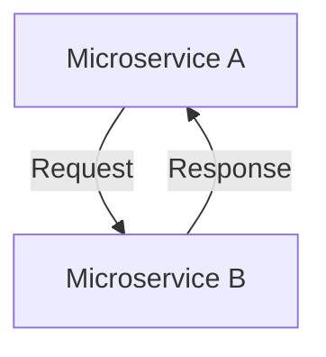
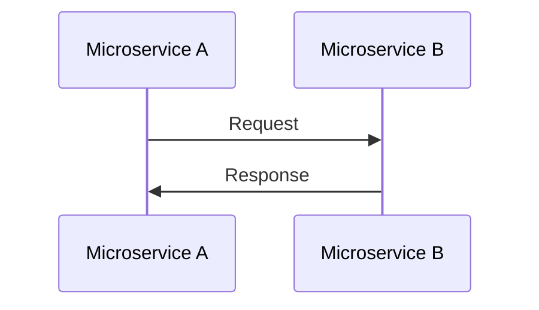
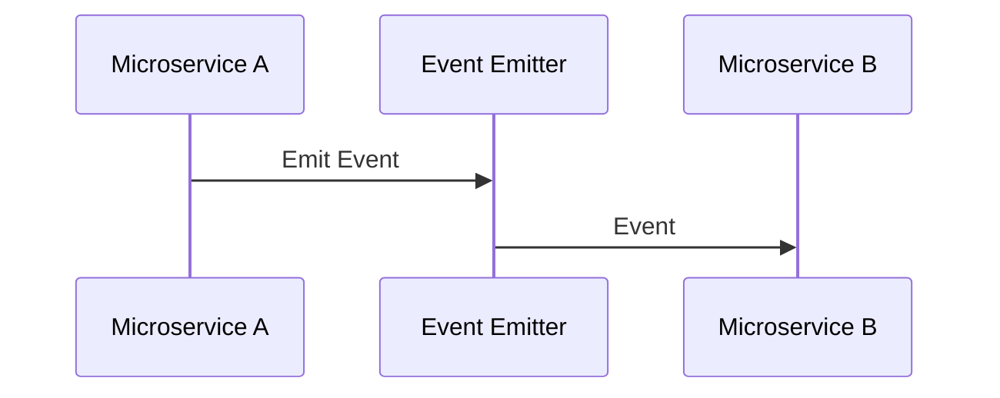
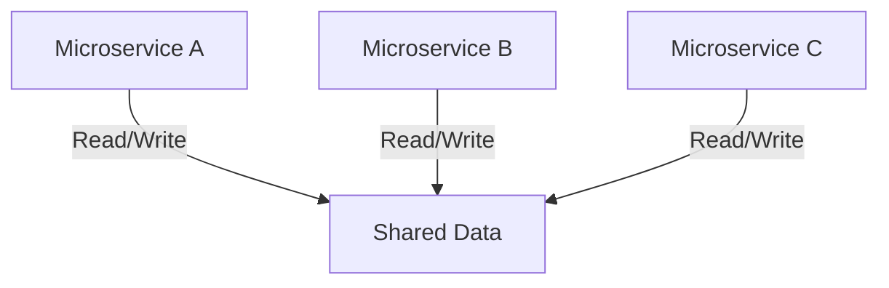

*Image source: [NTT Data](https://us.nttdata.com/en/blog/tech-blog/service-mesh-use-cases)*

Microservices architecture has revolutionized the way we design and deploy scalable applications. Central to this paradigm is the concept of inter-service communication. In this article, we delve deeper into various communication patterns utilized in microservices architecture, focusing on the **Service Mesh** level.

***

### Synchronous Blocking

**Overview:**
Synchronous communication involves a direct request from a microservice to another, blocking until the operation is complete. This pattern is akin to traditional function calls within a monolithic application.

**Pros:**
- **Simplicity:** The straightforward request-response model is easy to comprehend.
- **Sequential Execution:** Ensures ordered execution of tasks, ideal for scenarios where actions depend on specific sequences.

**Cons:**
- **Latency:** Delays may occur, especially in long invocation chains, impacting overall system responsiveness.
- **Dependency Risks:** Service outages can propagate, leading to cascading failures.

***

### Asynchronous Non-blocking

#### Request-Response Pattern

In this pattern, microservices send requests asynchronously and await responses. Asynchronous messaging systems like RabbitMQ or Kafka facilitate decoupled communication.

**Pros:**
- **Parallel Processing:** Enables parallel execution of tasks, enhancing overall system throughput.
- **Fault Tolerance:** Suited for scenarios where retries and error handling are crucial.

**Cons:**
- **Complexity:** Managing asynchronous tasks requires robust error handling and coordination mechanisms.
- **Timeouts:** Careful handling of timeouts is essential to prevent indefinite waiting.

#### Event-Driven Pattern

Microservices emit events without specific recipients. Other services can subscribe to relevant events, fostering loose coupling.

**Pros:**
- **Flexibility:** Decoupled services can evolve independently, accommodating changes without disrupting other services.
- **Scalability:** Well-suited for handling variable workloads, enabling responsive architectures.

**Cons:**
- **Event Schema:** Event structures need careful planning to ensure comprehensiveness, avoiding unnecessary coupling.
- **Event Choreography:** Coordinating event sequences might require additional effort and complexity.

***

### Common Data Pattern

In this pattern, microservices share a common data store, such as a data lake or database. Multiple services can read and write data independently, allowing seamless information exchange.

**Pros:**
- **Consistency:** Shared data ensures uniformity across services, preventing data inconsistencies.
- **Simplicity:** Relatively straightforward to implement, especially for simple applications.

**Cons:**
- **Latency:** Polling mechanisms introduce delays, affecting real-time data access.
- **Schema Rigidity:** Changes in the shared data schema necessitate careful coordination to prevent disruptions.

### Conclusion

Choosing the right communication pattern is pivotal in microservices design. Often, a hybrid approach combining multiple patterns addresses diverse application requirements. Understanding the intricacies of each pattern empowers architects and developers to make informed decisions, ensuring robust and responsive microservices ecosystems.

For in-depth exploration and practical insights, refer to the book *Building Microservices, 2nd Edition*[^1].

## References

[1]. [Building Microservices, 2nd Edition](https://www.oreilly.com/library/view/building-microservices-2nd/9781492034018/)
